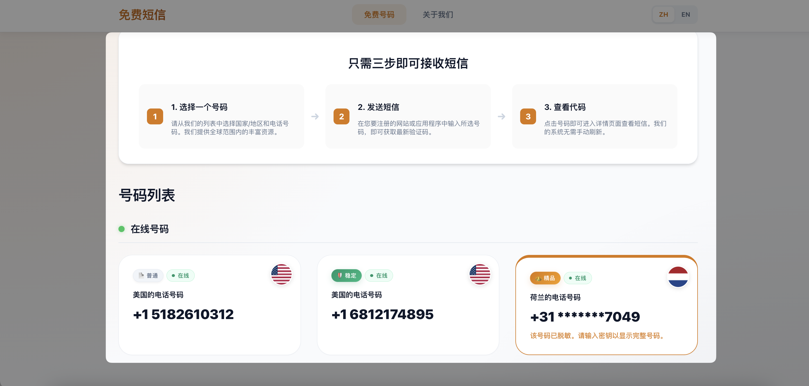
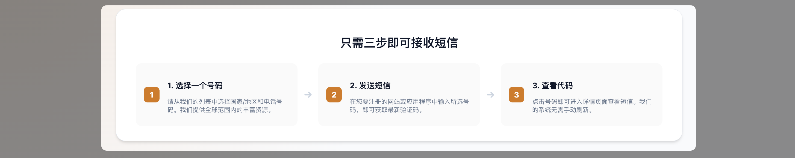
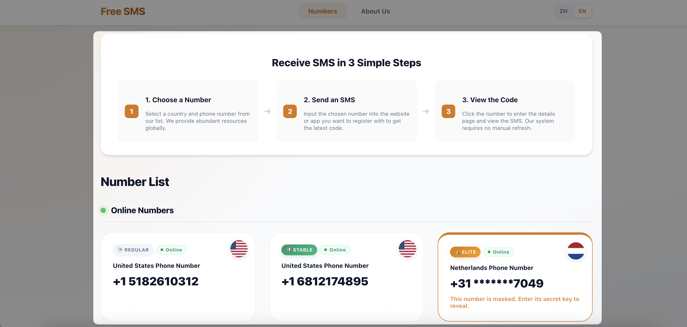

# 🌍 Free SMS - 全球免费隐私短信接收站 / Global Free Privacy SMS Receiving Station

[中文](#-free-sms---全球免费隐私短信接收站) | [English](#-free-sms---global-free-privacy-sms-receiving-station-1)

---

# 🌍 Free SMS - 全球免费隐私短信接收站

> **Protect Your Privacy. Stay Anonymous. Receive SMS Online.**
> 
> 🔗 **立即使用 (Access Now): [https://12380.xyz](https://12380.xyz)**

---

## 💡 为什么选择 免费短信 (Free SMS)?

在数字化时代，注册各种 APP 或服务时，手机号往往是“隐私泄露”的源头。**Free SMS** 旨在为您打造一道安全的数字屏障，让您在获取服务的同时，不再受骚扰短信和隐私泄露的困扰。

### 🌟 核心特性 (Key Features)

*   **🔒 绝对隐私 (Ultimate Privacy)**: 无需注册、无需绑定、无需提供任何个人信息。真正做到“用完即走”。
*   **🇺🇳 全球资源 (Global Resources)**: 实时提供来自美国、英国、芬兰、瑞典等多国的优质虚拟号码。
*   **⚡ 实时接收 (Real-time Speed)**: 毫秒级异步刷新技术，验证码瞬间到达，无需像传统网站那样频繁手动刷新。
*   **📱 极简体验 (Minimalist UI)**: 完美适配桌面与移动端，清新温暖的配色，让接收验证码也成为一种享受。

---

## 🛠️ 三步快速上手 (Quick Start)

1.  **选择号码 (Select)**: 在首页列表浏览，点击您需要的国家/地区号码。
2.  **发送短信 (Send)**: 在您要注册的网站或 APP 中输入该号码，点击发送验证码。
3.  **查看内容 (View)**: 详情页会自动弹出最新收到的短信，无需刷新，即刻复制。

---

## 📢 推广与合作

如果您觉得本服务对您有帮助，欢迎将它推荐给您的开发者社区或社交媒体！

*   **官方入口**: [https://12380.xyz](https://12380.xyz)
*   **项目定位**: 长期维护的免费隐私公益项目。

> *"Privacy is not an option, and it shouldn't be a luxury. It's a fundamental right."*

---

# 🌍 Free SMS - Global Free Privacy SMS Receiving Station

> **Protect Your Privacy. Stay Anonymous. Receive SMS Online.**
>
> 🔗 **Access Now: [https://12380.xyz](https://12380.xyz)**

---

## 💡 Why choose Free SMS?

In the digital age, when registering for various APPs or services, mobile phone numbers are often the source of "privacy leaks". **Free SMS** aims to build a secure digital barrier for you, allowing you to obtain services without being troubled by harassment messages and privacy leaks.

### 🌟 Key Features

*   **🔒 Ultimate Privacy**: No registration, no binding, no personal information required. Truly "use and leave".
*   **🇺🇳 Global Resources**: Real-time provision of high-quality virtual numbers from the United States, United Kingdom, Finland, Sweden, and more.
*   **⚡ Real-time Speed**: Millisecond-level asynchronous refresh technology, verification codes arrive instantly, no need to manually refresh frequently like traditional websites.
*   **📱 Minimalist UI**: Perfectly adapted to desktop and mobile, with fresh and warm colors, making receiving verification codes an enjoyment.

---

## 🛠️ Quick Start

1.  **Select**: Browse the list on the home page and click on the country/region number you need.
2.  **Send**: Enter the number on the website or APP you want to register for, and click to send the verification code.
3.  **View**: The details page will automatically pop up the latest received SMS, no need to refresh, copy instantly.

---

## 📢 Promotion and Cooperation

If you find this service helpful, please feel free to recommend it to your developer community or social media!

*   **Official Entry**: [https://12380.xyz](https://12380.xyz)
*   **Project Positioning**: A long-term maintained free privacy public welfare project.

> *"Privacy is not an option, and it shouldn't be a luxury. It's a fundamental right."*

---
© 2024 Free SMS Project. All Rights Reserved.
